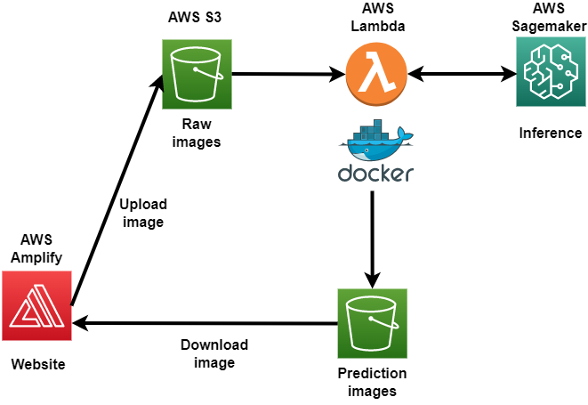

# Online-prediction
Online prediction using 3D U-Net tensorflow model. This serverless architecture is also can be used and extended to other end-to-end machine learning projects that using tensorflow. 

## Architecture

## Components
* [AWS Amplify](amplify/): A website for users to upload image files and download the prediction images.
* [AWS Lambda](lambda/): A serverless function to handle the prediction request and save the prediction output as an image to AWS S3.
* [AWS Sagemaker](sagemaker/): Hosting machine learning model to predict the segmentation mask of the uploaded image.

