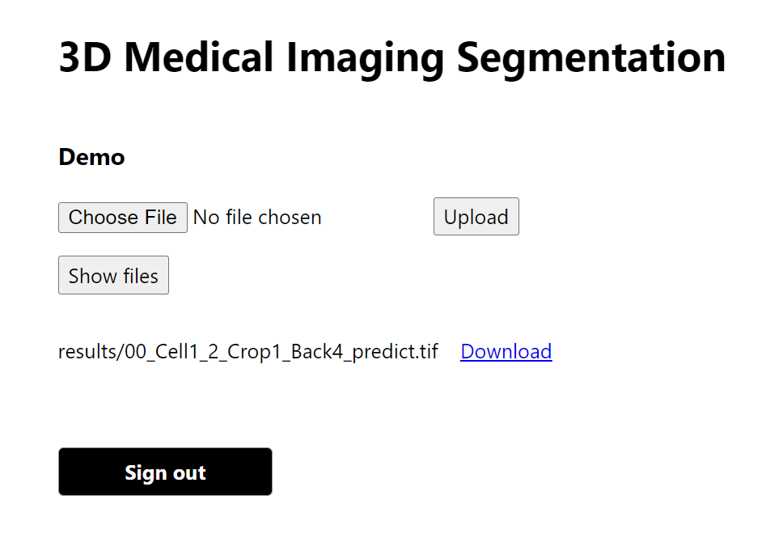

# AWS Amplify
A website for users to upload image files and download the prediction images.



* Install the AWS Amplify CLI
	```
	npm install -g @aws-amplify/cli
	```

* Configure the CLI with our credentials
	```
	amplify configure
	```

* Install AWS Amplify & AWS Amplify React libraries
	```
	npm install aws-amplify @aws-amplify/ui-react
	```

* Initializing Amplify project
	```
	amplify init
	```

* Pushing the changes to the AWS
	```
	amplify push
	```